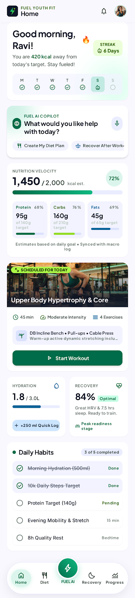
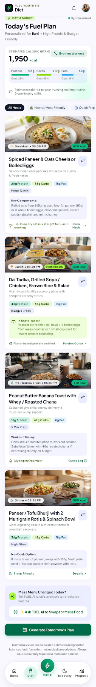
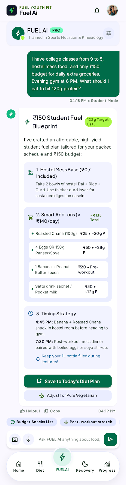
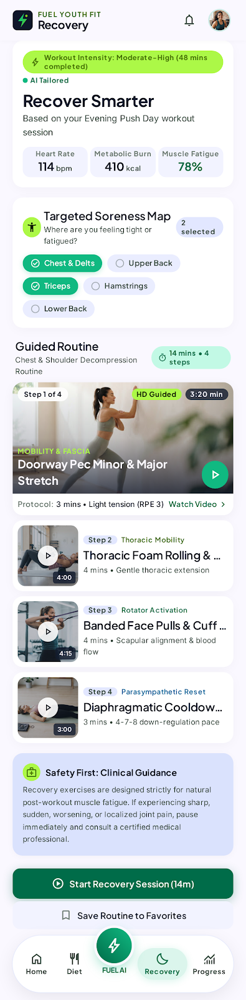

<div align="center">

# ⚡ FUEL YOUTH FIT

### Your training day, thoughtfully fueled.

An interactive fitness companion concept for everyday nutrition, recovery, and habits — designed from a product brief and brought to life as a responsive web prototype.

<p>
  <a href="https://kakuu666.github.io/Workshop-on-PRD-to-Github/"><strong>✦ Open the live demo</strong></a>
  ·
  <a href="#-explore-the-prototype">Explore the prototype</a>
  ·
  <a href="context.md">Product context</a>
</p>

<p>
  <a href="https://github.com/kakuu666/Workshop-on-PRD-to-Github"></a>
  <a href="https://github.com/kakuu666/Workshop-on-PRD-to-Github/actions/workflows/pages.yml"></a>
  
  
</p>

</div>

> **Portfolio prototype, not a health product:** Core screens and demo interactions are implemented. The example content is illustrative; the chat is scripted, with no AI service, account, or backend connected.

## ✨ Explore the prototype

| Home | Diet | FUEL AI | Recovery | Progress |
| --- | --- | --- | --- | --- |
| Daily overview, habits, hydration, and your workout | Example meals, nutrition estimates, filters, and saved plan | Conversational UI with sample, safety-conscious replies | Soreness check-in, gentle routine, and demo timer | Weekly activity, consistency, and example history |

**Try it:** Mark a habit complete, log water, filter or save the meal plan, ask the Copilot for a snack or recovery tip, select a soreness area, and start the recovery timer. A few demo preferences persist in your browser using `localStorage`.

## 📸 Product screenshots & flows

These concept screenshots show the broader product direction across nutrition planning, the fitness dashboard, post-workout recovery, and mobile. They are design explorations—not exact captures of the running prototype. Try the [live demo](https://kakuu666.github.io/Workshop-on-PRD-to-Github/) to experience the implemented screens and interactions.

<table>
  <tr>
    <td width="50%" align="center">
      
      <strong>Personalized diet plan</strong>
    </td>
    <td width="50%" align="center">
      
      <strong>Fitness dashboard &amp; mobile experience</strong>
    </td>
  </tr>
  <tr>
    <td width="50%" align="center">
      
      <strong>Post-workout recovery</strong>
    </td>
    <td width="50%" align="center">
      
      <strong>Mobile daily dashboard</strong>
    </td>
  </tr>
</table>

## 🎨 Design direction

These are the supplied sample screens that informed the visual direction. They are design references, not screenshots of the running prototype.

<p align="center">
  <a href="design/screenshots/home-dashboard.png"></a>
  <a href="design/screenshots/diet-plan.png"></a>
  <a href="design/screenshots/copilot-chat.png"></a>
  <a href="design/screenshots/recovery.png"></a>
</p>

## 🧠 From product brief to working prototype

This project demonstrates the complete path from product thinking to a shareable interface:

| Focus | What the project demonstrates |
| --- | --- |
| **Product strategy** | Translating a PRD into prioritized P0/P1/P2 capabilities, a north-star metric, counter-metrics, and explicit open decisions. |
| **Experience design** | Connecting five task-focused screens into a responsive, accessible experience, with clear safety boundaries for health-related content. |
| **Frontend craft** | Building interactive flows with semantic HTML, modern CSS, and dependency-free JavaScript. |
| **Delivery** | Publishing a static site through GitHub Actions and GitHub Pages, with no build step or service credentials. |

## 🧭 Product priorities

| Priority | Capability | Why it matters |
| :---: | --- | --- |
| **P0** | Personalized diet planning | Help people make practical food choices around their goals and routines. |
| **P1** | Post-workout recovery | Make recovery guidance easier to find and complete after training. |
| **P2** | Fitness progress tracking | Make saved plans and completed actions visible over time. |

The product brief's north star is month-over-month growth in active users completing diet and recovery activities. Drop-off and inactivity measures are important counter-metrics; success should not be reduced to engagement alone.

## 🚀 Run it locally

No framework, package manager, build step, or API key is needed.

1. Clone the repository:

   ```powershell
   git clone https://github.com/kakuu666/Workshop-on-PRD-to-Github.git
   cd Workshop-on-PRD-to-Github
   ```

2. Open `index.html` in a modern browser.

   Or serve it locally:

   ```powershell
   py -m http.server 8000
   ```

   Visit <http://localhost:8000>.

## 🌐 Publish with GitHub Pages

This repository includes a GitHub Actions workflow at `.github/workflows/pages.yml`.

1. Open the repository's **Settings → Pages**.
2. Under **Build and deployment**, choose **GitHub Actions** as the source.
3. Push to `main` (or run the workflow manually from **Actions**).
4. When the deployment succeeds, visit <https://kakuu666.github.io/Workshop-on-PRD-to-Github/>.

## 🛠️ Built with

- Semantic HTML, modern CSS, and vanilla JavaScript
- Responsive layouts, accessible labels, keyboard focus styles, and reduced-motion support
- Browser `localStorage` for a small set of non-sensitive demo preferences
- GitHub Pages for static hosting

## 🗂️ Project map

| Path | What you'll find |
| --- | --- |
| [`index.html`](index.html) | Five connected app views and semantic page structure |
| [`styles.css`](styles.css) | Responsive design system and screen styling |
| [`app.js`](app.js) | Navigation, filters, demo chat, timer, and browser-local state |
| [`assets/`](assets/) | Local athlete portrait used by the prototype |
| [`project screenshots/`](project%20screenshots/) | Product concept screenshots showing desktop, mobile, nutrition, and recovery flows |
| [`design/screenshots/`](design/screenshots/) | Curated design references from the supplied sample screens |
| [`context.md`](context.md) | Product goals, requirements, measures, and open decisions |
| [`plan.md`](plan.md) | Implementation phases, acceptance checks, and risks |
| [`.github/workflows/pages.yml`](.github/workflows/pages.yml) | Automated GitHub Pages deployment |

## 🩺 Safety, privacy & limitations

- **Not medical advice.** The prototype does not diagnose, assess, or treat health conditions. For pain or health concerns, consult a qualified healthcare professional; seek appropriate local emergency care for urgent symptoms.
- **Not live AI.** Chat responses are scripted examples. Messages are not sent to an AI model or external service.
- **Illustrative information.** Nutrition, training, readiness, and progress details are sample content—not measured user data or a prescription.
- **Local demo state only.** There is no sign-in, backend, cloud sync, secure health-data store, or server backup. Browser storage is used only for demo preferences.
- **External assets.** Meal photography and web fonts load from third-party services and require an internet connection. The app structure, scripts, styles, and athlete portrait are included locally.

## 🧩 What I'd build next

1. Validate the target user, persona, and end-to-end journeys.
2. Define privacy, consent, retention, and health-concern escalation before collecting personal data.
3. Select the product platform, technical architecture, content sources, and recommendation approach.
4. Test the P0 diet-planning flow and its three-to-four-interaction usability target.
5. Add reviewed, accessible recovery content and meaningful progress instrumentation.

See the [product context](context.md) and [implementation plan](plan.md) for detail.

## 📌 Source & attribution

The product direction comes from the supplied FUEL YOUTH FIT product requirements document. The visual direction was informed by the sample screens included with the project. The interactive app is an original static prototype and does not run the generated screen HTML as its application runtime.

---

<div align="center">
  <sub>Made as a product-to-prototype portfolio project · Built to help people fuel good habits, one day at a time.</sub>
</div>
